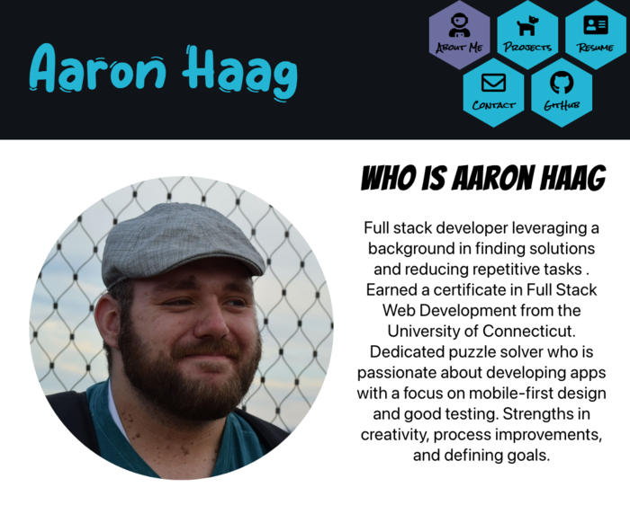

# My React Portfolio

## Introduction
Hello! My name is Aaron Haag, I'm a full stack developer from the east coast. This is the repo for my personal portfolio built with React, Framer Motion and Node.js. It is hosted on Github pages.

## Some fun little things
A few of the things I'm proud of are the hexagonal nav buttons (created using CSS clip paths), the animated timeline (created with a custom made SVG) and the excellent Lighthouse score in the Chrome Dev tools. 

## License and contributions
There is currently no license as this is a personal portfolio, but feel free to look around if there's anything that you want to try for yourself. 

I am not currently open to contributions on this project. 